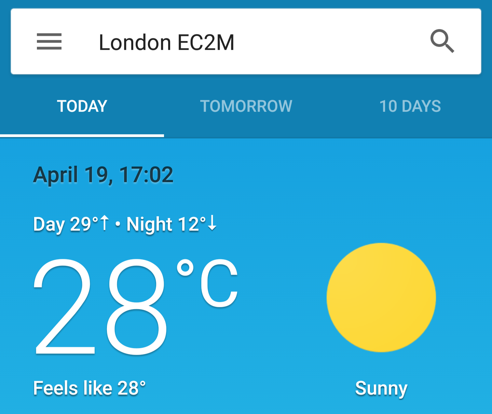

Welcome to my third blog! In this blog, I’ll talk about the European migrant crisis, doughnuts, the bench press and React.

Two of my three flatmates study European Studies at King’s College London and they are a part of the [KCL European Society](https://www.kclsu.org/organisation/European/). From Monday to Friday, during their European week, they have invited influential people to have a discussion about sensitive trending topics about Europe and its relations.
I went to the **European migrant crisis and its issues in the security field**, which focused on Syrian refugees. The discussion was really interesting and drastically changed my views on the situation. One of the speakers was Ms Lily Eckersley-Jones, co-founder of Atlantic Pacific, an international rescue charity that provides lifeboats. She herself was present during these rescue missions, which made her story really eye-opening.

On a less serious note: Collin, the Solution Architect at Enepath, celebrated his birthday by bringing a box of doughnuts to work. Which in itself is a nice gesture, but the taste of these doughnuts made it something I will remember for a long time. These doughnuts were the best doughnuts I have ever eaten in my life. Nothing comes close to its taste. It was incredibly delicious! Thank you, Collin!

When I arrived in London, I started going the gym again. I took quite a long break before I came here so it took me a while to get back to my previous strength level. Now, going to the gym isn’t exactly exciting, but hitting a new PR (personal record) is. I try to become stronger in 3 compound movements, one of which is the bench press.
The gym I go to gets really busy, so when I wanted to hit the bench press, both of the machines were occupied. So I asked one the guys how many sets he had left and he had just 2 more to go, but he proposed me to jump in. I did, and we started talking. Usually, I train alone, which means I don’t have anyone to spot the weight. But this guy was willing to stay a bit longer and help me test my 1RM (one repetition max). This gave me the confidence to up the weight and I actually hit my previous PR. This made my day and proved that I was doing things right.

I’m still working on the config node at Enepath. I’ve decided to use React to build it. In order to start developing in React, I had to learn how to use some other tools. One of those tools was [Webpack](https://webpack.js.org/). The logic behind it is pretty straight-forward but nevertheless required some research in order to set up a custom configuration. I actually prefer using it over [Grunt](https://gruntjs.com/) or [Gulp](https://gulpjs.com/)!
React itself isn’t really a framework, it’s more like a library. There are other packages out there such as react-router for client-side routing and Redux for state management, which you can add and combine to create your own custom framework. 

Oh and the weather is really nice now!

Compared to the weather I wrote about in [my previous blog](https://blog.rubenthys.me/weird-weather/)!

Thank you for reading my third blog post!
