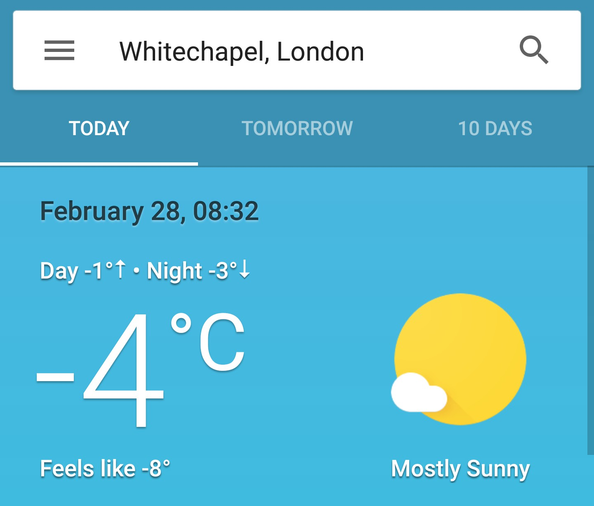

Hello there and welcome to blog number two!

Let’s kick things off with the the weird weather here in London. Snow. Yes, it snowed! According to Google Weather the temperature felt like minus eight degrees Celsius! Everyone went to work in their snow boots while wearing their suit, so that was quite funny to see. That also meant that I had another excuse to wear my six inch Timberlands again. Yay! And although the streets were very slippery, I enjoyed my walks to and from work in the snow.

With the weather as cold as it was, a nice hot shower in the morning is more appreciated than ever. Well, though luck. The water boiler stopped working and my showers, which I always start with cold water, never turned hot. And the water felt even more cold than usual, so for three mornings I had to face the coldest showers of my life! And to top things off, the heating just gave up. Apparently the cold weather messed with the gas supply and it took about a week for the British Gas Company to come to our house and fix it.
Oh, and the washing machine is still broken. The landlord promised to install a new one, but it is taking some time.

So yeah, weird weather.

At work I continued working on designing the config node. Since it is my first time using Sketch as a design tool, I had to learn the hard way that you should always start by designing the smallest components first. This mistake costed me a lot of time, but now I know I won’t make it twice!

Wednesday was an exiting day for me. The day before, Gavin asked me if I would be okay if a client would come and ask me some questions about the work I was doing. The client, which I won’t name, is a major airline company who is looking to upgrade their communication platform. It’s a big deal because their user base is quite large.

The next day I was waiting for the client to arrive. Gavin and the engineering team were at the sales office, which is located in the Blue Fin Building. And at around midday, Gavin called Damo to ask if I could come to them instead. I said yes and I left immediately. It was a 30 minute walk. I had no idea what to expect. I just figured they would aks me some questions about my work. But when I arrived, there was a meeting room filled with people. At first everyone was scattered and were having some conversations. I didn’t know anyone there so I just stood there and listened to what they had to say. After a while I was asked to connect my laptop to a big monitor and then Gavin introduced me that I would talk a bit about the work I had done.

So there I was, presenting my work for a whole group of people I had never seen before and who were a potential big client. I was not prepared. I just tried to explain how my work would improve the workflow of it’s users. I was a bit nervous which caused my explanation to be too detailed at times. So it was far from perfect, but still, everyone seemed to be convinced.

Afterwards, I was told that I did a good job and the chances of a successful deal were high. I was happy for everyone. They all worked hard to sell our product. I feel lucky that I was given the chance to be part of it.

To conclude: Snow in February is unusual, long cold showers can give you a ‘brain freeze’ and if you spent a lot of time working on something, talking about it becomes fairly easy.